# Clase 2 - REST APIs y Persistencia

## Objetivo
Implementar un CRUD sencillo con Spring Data JPA.

## Pasos
1. Configurar PostgreSQL con Docker Compose, configuraciones en IDE y mapeo de la entidad product 
2. Ejecutar la aplicación (`mvn spring-boot:run`).
3. Probar endpoints con Postman (capturas en screenshot/).

## Configurar PostgreSQL con Docker Compose, configuraciones en IDE y mapeo de la entidad product 

Instalación del contenedor docker compose
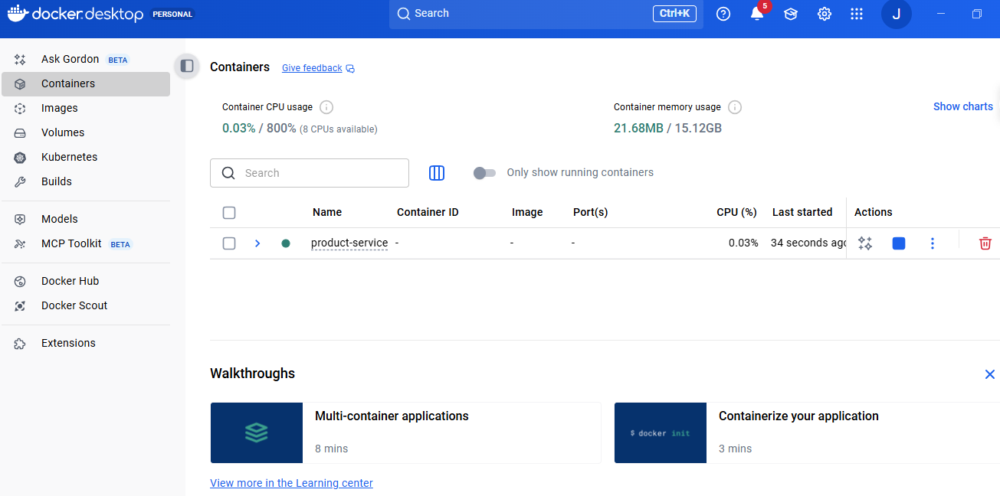

Inicio del contenedor mediante la herramienta Windows PowerShell, con el siguiente comando:

docker compose up -d

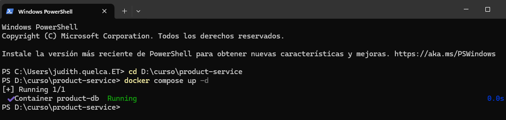

Adición de dependencia en pom.xml, creación del archivo docker-compose.yml y application.yml

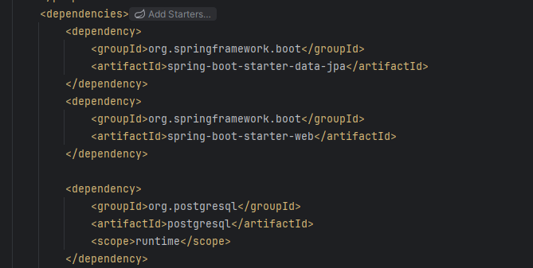
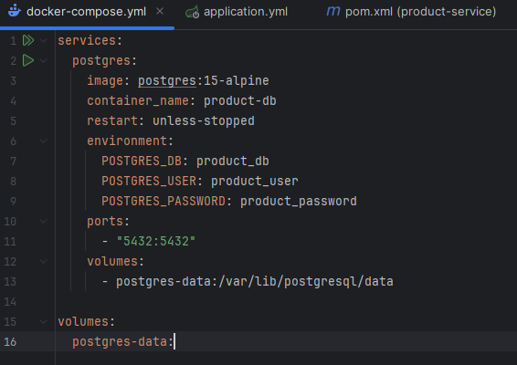
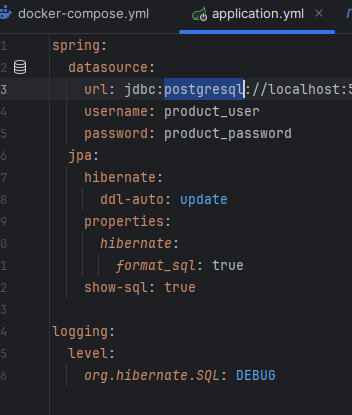	

Mapeo de la entidad Product y creación del repositorio lo que permite persistir datos en PostgreSQL. 
Mediante DBeaver se puede ver la creación de la tabla products

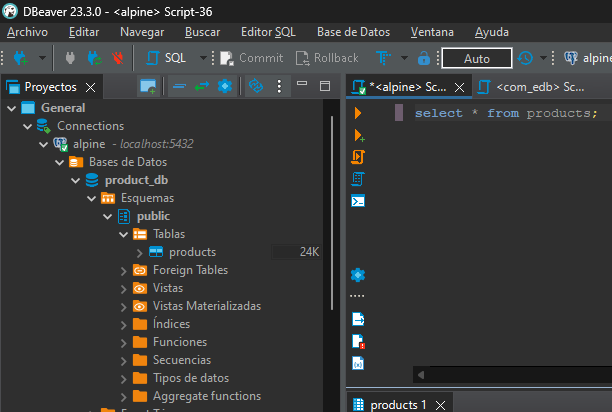

## Ejecutar la aplicación

Cuando se realiza las pruebas con postman se puede ver como se persiste en la Base de Datos.

### insert

insert 
    into
        products
        (created_at, description, name, price, stock, updated_at) 
    values
        (?, ?, ?, ?, ?, ?)
		
Hibernate: 
    insert 
    into
        products
        (created_at, description, name, price, stock, updated_at) 
    values
        (?, ?, ?, ?, ?, ?)
		
### Select (name)

 select
        p1_0.id,
        p1_0.created_at,
        p1_0.description,
        p1_0.name,
        p1_0.price,
        p1_0.stock,
        p1_0.updated_at 
    from
        products p1_0 
    where
        upper(p1_0.name) like upper(?) escape '\'
		
Hibernate: 
    select
        p1_0.id,
        p1_0.created_at,
        p1_0.description,
        p1_0.name,
        p1_0.price,
        p1_0.stock,
        p1_0.updated_at 
    from
        products p1_0 
    where
        upper(p1_0.name) like upper(?) escape '\'
		
### Select (id)

select
        p1_0.id,
        p1_0.created_at,
        p1_0.description,
        p1_0.name,
        p1_0.price,
        p1_0.stock,
        p1_0.updated_at 
    from
        products p1_0 
    where
        p1_0.id=?
		
Hibernate: 
    select
        p1_0.id,
        p1_0.created_at,
        p1_0.description,
        p1_0.name,
        p1_0.price,
        p1_0.stock,
        p1_0.updated_at 
    from
        products p1_0 
    where
        p1_0.id=?
		
### update

 update
        products 
    set
        created_at=?,
        description=?,
        name=?,
        price=?,
        stock=?,
        updated_at=? 
    where
        id=?
		
Hibernate: 
    update
        products 
    set
        created_at=?,
        description=?,
        name=?,
        price=?,
        stock=?,
        updated_at=? 
    where
        id=?
		
### delete

    delete
    from
        products 
    where
        id=?
		
Hibernate: 
    delete 
    from
        products 
    where
        id=?
		
## Probar endpoints con Postman

### POST
POST /api/products crea un producto con los campos name, description, price, stock.

http://localhost:9494/api/products

JSON
{
    "id": 2,
    "name": "Laptop DELL",
    "description": "Modelo 2025",
    "price": 1299.90,
    "stock": 5,
    "createdAt": "2025-10-30T18:15:07.654593-04:00",
    "updatedAt": "2025-10-30T18:15:07.654593-04:00"
}

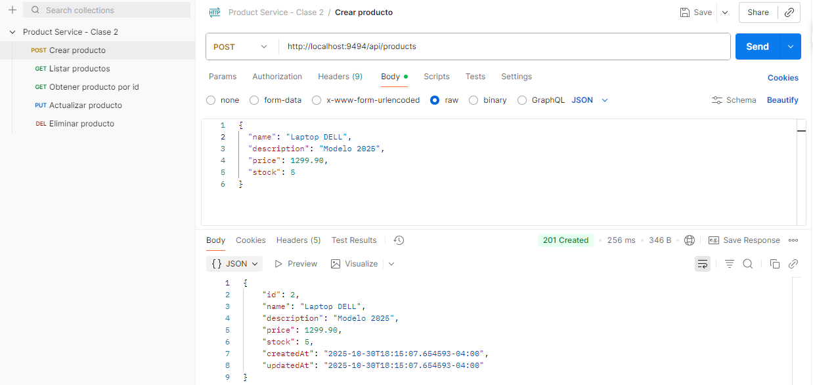

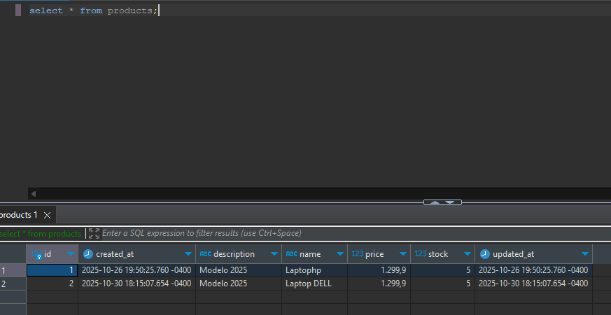

### GET (name)

GET /api/products lista todos los productos y permite filtrar por nombre con ?name=.

http://localhost:9494/api/products?name=laptop DELL

JSON
[
    {
        "id": 2,
        "name": "Laptop DELL",
        "description": "Modelo 2025",
        "price": 1299.90,
        "stock": 5,
        "createdAt": "2025-10-30T22:15:07.654593Z",
        "updatedAt": "2025-10-30T22:15:07.654593Z"
    }
]
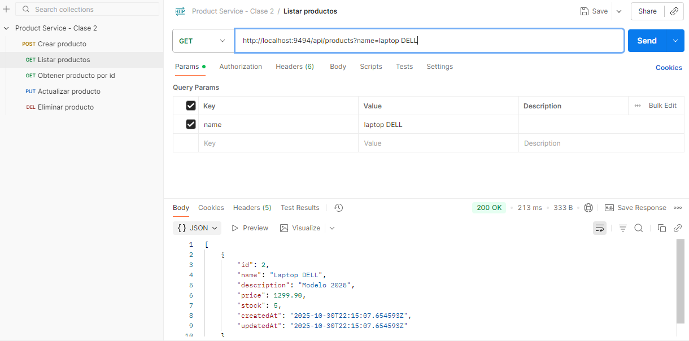

### GET (id)

GET /api/products/{id} devuelve un producto por su identificador.

http://localhost:9494/api/products/2

JSON
{
    "id": 2,
    "name": "Laptop DELL",
    "description": "Modelo 2025",
    "price": 1299.90,
    "stock": 5,
    "createdAt": "2025-10-30T22:15:07.654593Z",
    "updatedAt": "2025-10-30T22:15:07.654593Z"
}
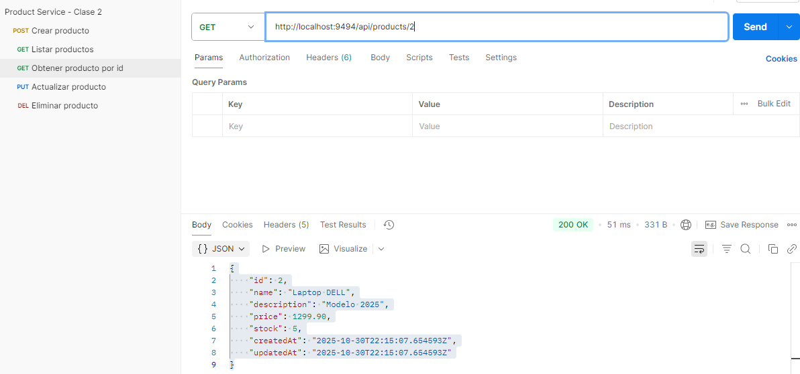

### DELETE

DELETE /api/products/{id} elimina un producto.

Se elimina el id=2 (name = "laptop DELL")

http://localhost:9494/api/products/2

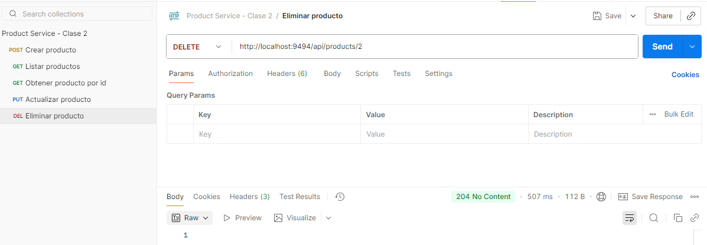
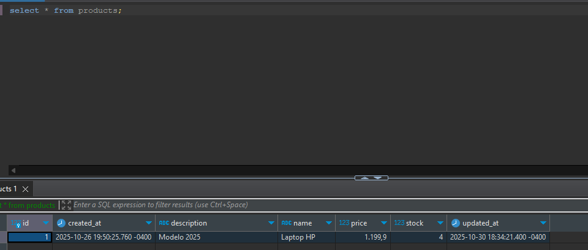

### PUT 

PUT /api/products/{id} actualiza un producto existente (todos los campos).

http://localhost:9494/api/products/1

Se modifico el name de "laptop HP" a "laptop HP GAMER"
{
    "id": 1,
    "name": "laptop HP GAMER",
    "description": "Modelo 2025 actualizado",
    "price": 1199.90,
    "stock": 4,
    "createdAt": "2025-10-26T23:50:25.760284Z",
    "updatedAt": "2025-10-30T19:20:07.8078038-04:00"
}

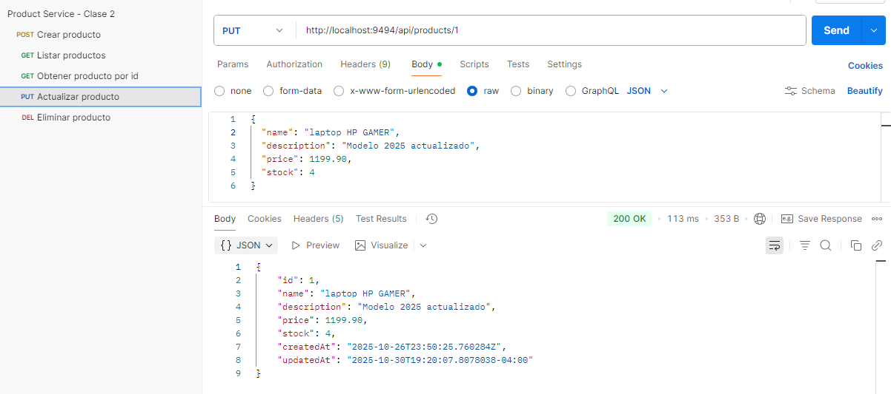
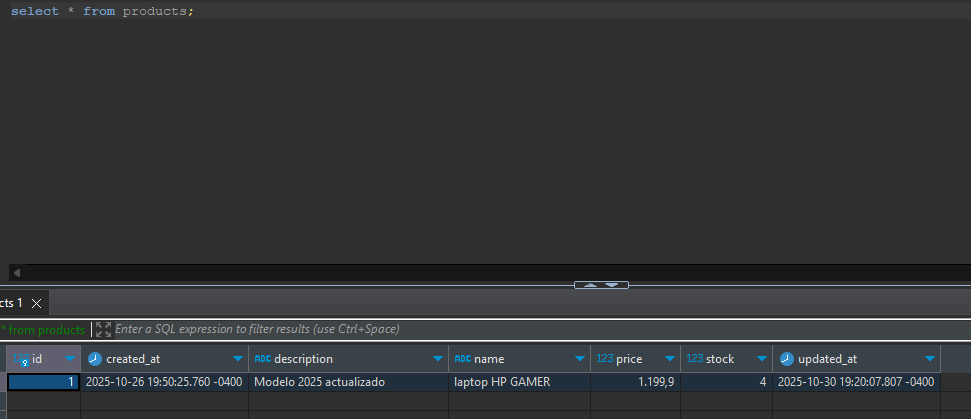								

## Autor
Judith Quelca - Curso Spring Boot & Kafka